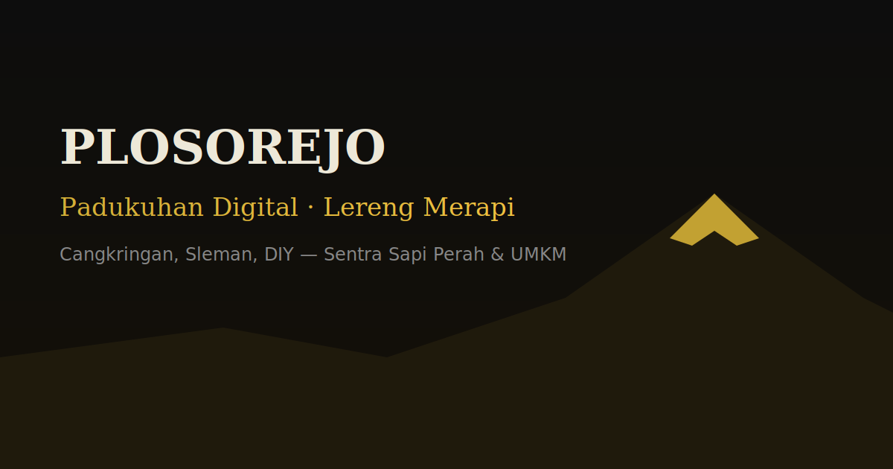

<div align="center">

# Padukuhan Plosorejo

### Portal Digital Resmi · Cangkringan · Sleman · DIY

**Website padukuhan modern** untuk warga, wisatawan, dan mitra —  
profil desa, berita, UMKM, peta interaktif, layanan administrasi,  
status Gunung Merapi real-time, dan CMS non-IT friendly.

<br />

[](https://plosorejo-web.vercel.app)
[](https://nextjs.org)
[](https://react.dev)
[](https://www.sanity.io)
[](https://www.typescriptlang.org)
[](https://tailwindcss.com)
[](#lisensi)

<br />

**[🌐 Buka Live Site](https://plosorejo-web.vercel.app)** ·
**[🎛️ CMS Studio](https://plosorejo-web.vercel.app/studio)** ·
**[🌋 API Merapi](https://plosorejo-web.vercel.app/api/merapi)** ·
**[📘 CMS Guide](./CMS.md)** ·
**[🗺️ Roadmap](./ROADMAP.md)**

<br />



<sub>Tema **dark + gold** · mobile-first · CMS hybrid · data Merapi dari MAGMA ESDM</sub>

</div>

---

## Mengapa proyek ini ada

Padukuhan Plosorejo berada di lereng Gunung Merapi — sentra sapi perah, UMKM lokal, dan destinasi wisata.  
Informasi penting sering tersebar di grup chat, kertas, atau lisan.

**Plosorejo Web** menyatukan semuanya dalam satu portal resmi yang:

| Untuk warga | Untuk pengunjung | Untuk admin desa |
|---|---|---|
| Berita & pengumuman | Profil & peta | CMS tanpa coding |
| Layanan administrasi | Direktori UMKM | Status Merapi hybrid |
| Kontak WhatsApp 1-klik | Sektor & galeri | Backup konten JSON |

> Dibangun sebagai kontribusi digital **KKN** agar tetap bisa dipakai setelah mahasiswa pulang.

---

## Fitur utama

### 🏡 Portal padukuhan
- Beranda premium (hero Merapi, statistik, sektor, berita, UMKM)
- Halaman profil, berita, galeri, kontak, layanan administrasi
- Halaman sektor: peternakan, pertanian, UMKM, pariwisata, pendidikan, kesehatan, budaya
- Halaman khusus: **produksi susu** (`/susu`) & **arsip KKN** (`/kkn`)

### 🗺️ Peta interaktif
- Leaflet map berpusat di Padukuhan Plosorejo
- Poligon RT organik + POI (masjid, balai, wisata, UMKM, dll.)
- Mobile-friendly controls

### 🌋 Status Gunung Merapi (hybrid real-time)
- Auto-fetch dari **MAGMA ESDM / PVMBG**
- Override manual via Sanity (bila admin ingin kunci level)
- Widget warna level: Normal · Waspada · Siaga · Awas
- Endpoint publik: [`GET /api/merapi`](https://plosorejo-web.vercel.app/api/merapi)

### ✍️ CMS non-IT friendly (Sanity)
- Studio di `/studio`
- Konten: berita, UMKM, galeri, sektor, Merapi, layanan, KKN, susu, pengaturan situs
- **Fallback JSON** — site tetap hidup meski CMS kosong / offline

### 🎨 UX & desain
- Tema **dark + gold** premium + mode terang
- Mobile-first: target sentuh ≥ 44px, navbar tetap tappable
- Share berita (WhatsApp / Facebook / X)
- Order UMKM lewat WhatsApp dinamis

---

## Tech stack

```text
┌────────────────────────────────────────────────────────────┐
│                     Plosorejo Web                          │
├──────────────────┬───────────────────┬─────────────────────┤
│  Frontend        │  Content          │  Ops / Data         │
│  Next.js 16      │  Sanity CMS       │  MAGMA ESDM         │
│  React 19        │  JSON fallback    │  Vercel deploy      │
│  TypeScript      │  next-sanity      │  ISR / revalidate   │
│  Tailwind CSS 4  │  Sanity Studio    │  content backup     │
│  Leaflet map     │  Image CDN        │  seed scripts       │
└──────────────────┴───────────────────┴─────────────────────┘
```

| Layer | Pilihan | Alasan |
|---|---|---|
| Framework | **Next.js App Router** | SSR/ISR, route API, SEO |
| UI | **Tailwind 4 + custom tokens** | tema dark/gold konsisten |
| CMS | **Sanity** | admin visual, non-IT friendly |
| Maps | **Leaflet + react-leaflet** | ringan, offline-friendly tiles |
| Status Merapi | **MAGMA + Sanity override** | resmi + bisa dikunci admin |
| Hosting | **Vercel** | deploy otomatis dari `main` |

---

## Arsitektur konten (hybrid)

```text
                    ┌─────────────────┐
   Admin desa  ───► │  Sanity Studio  │  /studio
                    └────────┬────────┘
                             │ publish
                             ▼
┌──────────────┐    ┌─────────────────┐    ┌──────────────────┐
│ content/*.json│◄──│   lib/data.ts   │───►│  Pages / Widgets │
│  (fallback)   │    │  get* helpers   │    │  beranda, peta…  │
└──────────────┘    └────────┬────────┘    └──────────────────┘
                             │
                    ┌────────▼────────┐
                    │  MAGMA ESDM     │  status Merapi auto
                    │  /api/merapi    │
                    └─────────────────┘
```

**Prioritas data**
1. Sanity (jika terisi & reachable)
2. Fallback JSON lokal di `content/`
3. Untuk Merapi: MAGMA → Sanity override → fallback

Detail: [`docs/MERAPI-STATUS.md`](./docs/MERAPI-STATUS.md) · [`CMS.md`](./CMS.md)

---

## Demo & endpoint

| Resource | URL |
|---|---|
| 🌐 Production | https://plosorejo-web.vercel.app |
| 🎛️ CMS Studio | https://plosorejo-web.vercel.app/studio |
| 🌋 Merapi JSON | https://plosorejo-web.vercel.app/api/merapi |
| 🗺️ Peta | https://plosorejo-web.vercel.app/peta |
| 🏪 UMKM | https://plosorejo-web.vercel.app/sektor/umkm |
| 🧾 Layanan | https://plosorejo-web.vercel.app/layanan |

```bash
# contoh status Merapi
curl -s https://plosorejo-web.vercel.app/api/merapi | jq .
```

---

## Mulai lokal (5 menit)

### Prasyarat
- Node.js **20+**
- npm / pnpm / yarn
- (opsional) akun Sanity untuk CMS live

### 1) Clone & install

```bash
git clone https://github.com/haviq/plosorejo-web.git
cd plosorejo-web
npm install
```

### 2) Environment

Buat `.env.local`:

```bash
NEXT_PUBLIC_SANITY_PROJECT_ID=p7xgykwm
NEXT_PUBLIC_SANITY_DATASET=production
NEXT_PUBLIC_SANITY_API_VERSION=2025-01-01

# opsional — hanya untuk seed / write
# SANITY_API_WRITE_TOKEN=sk...
```

> Tanpa env Sanity pun, website **tetap jalan** lewat fallback JSON.

### 3) Jalankan

```bash
npm run dev
```

Buka:
- Site → http://localhost:3000
- Studio → http://localhost:3000/studio

### 4) Build production

```bash
npm run build
npm start
```

---

## Scripts

| Command | Fungsi |
|---|---|
| `npm run dev` | Development server |
| `npm run build` | Production build |
| `npm start` | Serve hasil build |
| `npm run lint` | ESLint |
| `npm run sanity` | Sanity CLI dev |
| `npm run sanity:deploy` | Deploy hosted Studio (opsional) |
| `npm run cms:seed` | Seed konten awal ke Sanity |
| `npm run content:backup` | Backup `content/*.json` |

---

## Struktur repositori

```text
plosorejo-web/
├── app/                    # Next.js App Router
│   ├── page.tsx            # Beranda
│   ├── berita/             # List + detail berita
│   ├── peta/               # Leaflet map
│   ├── sektor/             # 7 sektor padukuhan
│   ├── layanan/            # Administrasi warga
│   ├── studio/             # Sanity Studio embed
│   ├── api/
│   │   ├── merapi/         # Status Merapi live
│   │   └── cron/merapi/    # Refresh helper
│   └── globals.css         # Design tokens dark/gold
├── components/             # UI (Nav, Merapi, UMKM, …)
├── content/                # JSON fallback offline-first
├── lib/                    # data layer, merapi, site utils
├── sanity/                 # schema + queries
├── scripts/                # seed + backup
├── docs/                   # SOP, Merapi, go-live
├── CMS.md                  # Panduan CMS
├── ROADMAP.md              # Status 3 fase
└── DESIGN.md               # Design system notes
```

---

## CMS & operasional admin

Admin desa **tidak perlu coding**.

1. Buka `/studio`
2. Edit berita / UMKM / galeri / pengaturan
3. **Publish**
4. Website refresh otomatis (revalidate)

Panduan:
- [`CMS.md`](./CMS.md) — setup project, env, seed
- [`docs/SOP-ADMIN.md`](./docs/SOP-ADMIN.md) — alur harian admin
- [`docs/GO-LIVE.md`](./docs/GO-LIVE.md) — checklist production

### Seed konten (IT)

```bash
export SANITY_API_WRITE_TOKEN=sk...
npm run cms:seed
```

### Backup konten lokal

```bash
npm run content:backup
# hasil di content/backups/
```

---

## Status Merapi — cara kerja

```text
Sanity.manualOverride?
   ├─ true  → pakai level admin CMS
   └─ false → fetch MAGMA tingkat-aktivitas
                 ├─ sukses → widget auto (Siaga/Normal/…)
                 └─ gagal  → CMS / fallback lokal
```

| Level MAGMA | UI |
|---|---|
| I | Normal (emas) |
| II | Waspada (kuning) |
| III | Siaga (oranye) |
| IV | Awas (merah) |

Sumber resmi: [MAGMA ESDM](https://magma.esdm.go.id/v1/gunung-api/tingkat-aktivitas)

---

## Desain sistem (ringkas)

| Token | Dark | Light |
|---|---|---|
| Accent | Gold `#D4AF37` | Gold deepened |
| Surface | Near-black panels | Soft cream cards |
| Text | High-contrast white | Deep ink |
| Hero | Full-bleed Merapi imagery | Same, adjusted overlays |

Prinsip UI:
- **Mobile taps first** — overlay tidak boleh menahan klik
- Decorative layers: `pointer-events: none`
- CTA min **44×44**
- Kontras cukup untuk warga non-IT

Lihat juga: [`DESIGN.md`](./DESIGN.md)

---

## Deploy (Vercel)

Production mengikuti branch **`main`**.

### Checklist
1. Import repo ke Vercel  
2. Set env:
   - `NEXT_PUBLIC_SANITY_PROJECT_ID`
   - `NEXT_PUBLIC_SANITY_DATASET`
   - `NEXT_PUBLIC_SANITY_API_VERSION`
3. Deploy  
4. Register Sanity Studio origin production  
5. Verifikasi:
   - https://plosorejo-web.vercel.app
   - `/studio`
   - `/api/merapi`

> **Catatan Hobby plan:** jangan set Vercel Cron sub-daily di `vercel.json`  
> (bisa gagalkan deploy). Merapi tetap di-refresh lewat revalidate halaman + `/api/merapi`.

---

## Roadmap status

| Fase | Fokus | Status |
|---|---|---|
| **A** | Fondasi resmi + CMS + fallback | ✅ |
| **B** | Fitur warga (layanan, share, peta, UMKM WA) | ✅ |
| **C** | Data ops (susu, KKN, backup) | ✅ fondasi |

Detail: [`ROADMAP.md`](./ROADMAP.md)

### Prioritas berikutnya
- [ ] Upload foto asli (ganti SVG placeholder)
- [ ] Latih 1–2 admin desa dengan SOP
- [ ] Sinkron nomor WA & jam layanan real
- [ ] Monitoring uptime / error production

---

## Kontribusi

Kontribusi untuk perbaikan bug, aksesibilitas, dan konten sangat diterima.

```bash
# 1. fork / branch
git checkout -b feat/nama-fitur

# 2. dev
npm run dev

# 3. pastikan build lulus
npm run build

# 4. PR ke main
```

**Konvensi singkat**
- TypeScript strict, jangan bypass sembarangan
- UI mobile dulu, desktop kemudian
- Konten dinamis lewat Sanity / `content/*` — jangan hardcode panjang di JSX
- Setelah push production: cek Vercel status = **success** sebelum percaya live

---

## Dokumentasi terkait

| Dokumen | Isi |
|---|---|
| [`CMS.md`](./CMS.md) | Setup Sanity, seed, fallback |
| [`ROADMAP.md`](./ROADMAP.md) | Status 3 fase |
| [`DESIGN.md`](./DESIGN.md) | Design tokens & arah visual |
| [`docs/MERAPI-STATUS.md`](./docs/MERAPI-STATUS.md) | Hybrid Merapi |
| [`docs/SOP-ADMIN.md`](./docs/SOP-ADMIN.md) | SOP admin desa |
| [`docs/GO-LIVE.md`](./docs/GO-LIVE.md) | Checklist go-live |

---

## Tim & kredit

| Peran | Keterangan |
|---|---|
| Lokasi | Padukuhan Plosorejo, Umbulharjo, Cangkringan, Sleman 55583 |
| Inisiatif | KKN digitalisasi padukuhan |
| Data Merapi | MAGMA ESDM / PVMBG |
| Stack | Next.js · React · Sanity · Leaflet · Vercel |

Terima kasih untuk perangkat desa, warga, pelaku UMKM, dan tim KKN yang menjaga data tetap hidup.

---

## Lisensi

Repositori ini **private / internal padukuhan** kecuali dinyatakan lain oleh pemilik repo.  
Konten desa (berita, foto warga, data UMKM) milik Padukuhan Plosorejo.

---

<div align="center">

**Plosorejo Digital** — desa yang hidup, potensi yang nyata.

[Live Site](https://plosorejo-web.vercel.app) ·
[Studio](https://plosorejo-web.vercel.app/studio) ·
[API Merapi](https://plosorejo-web.vercel.app/api/merapi)

<br />

<sub>Built with care for the people of Plosorejo · Merapi foothills · DIY</sub>

</div>
